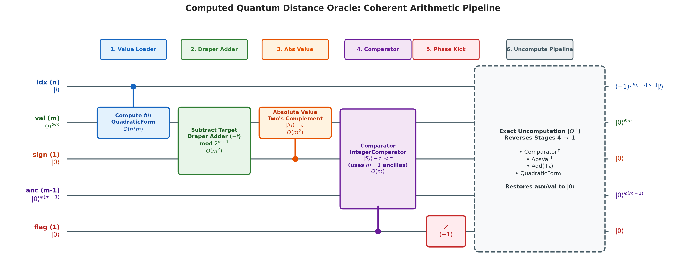
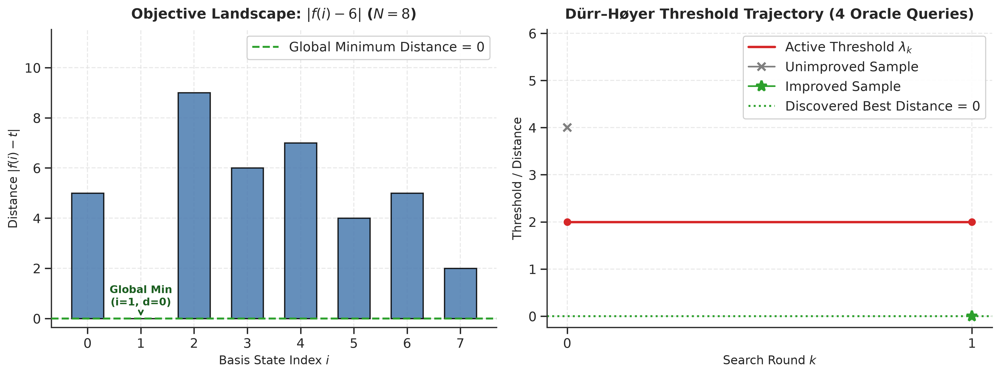
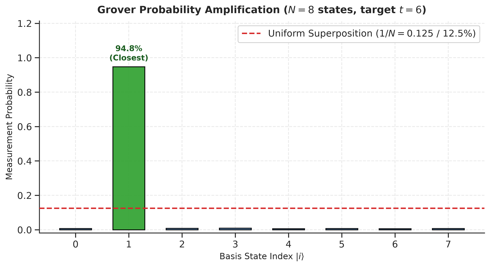
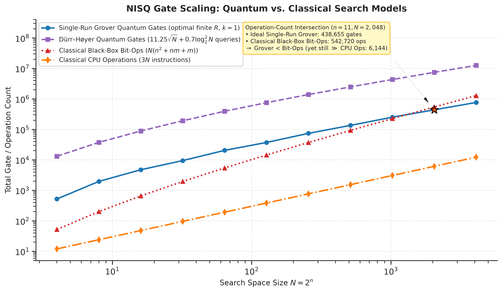
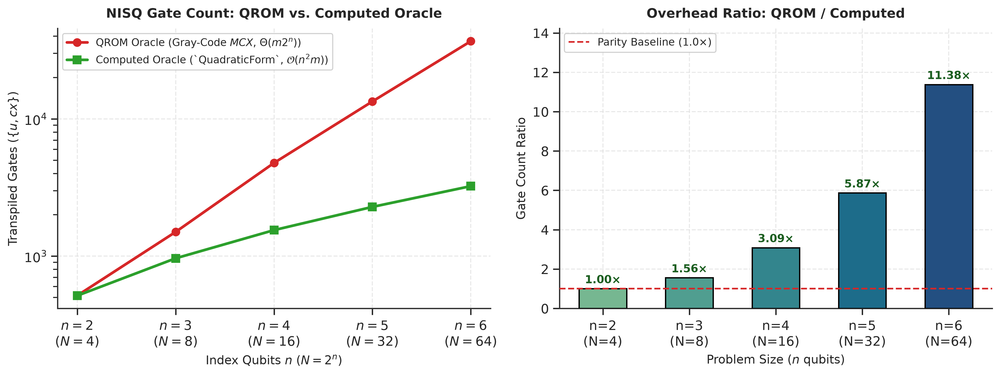
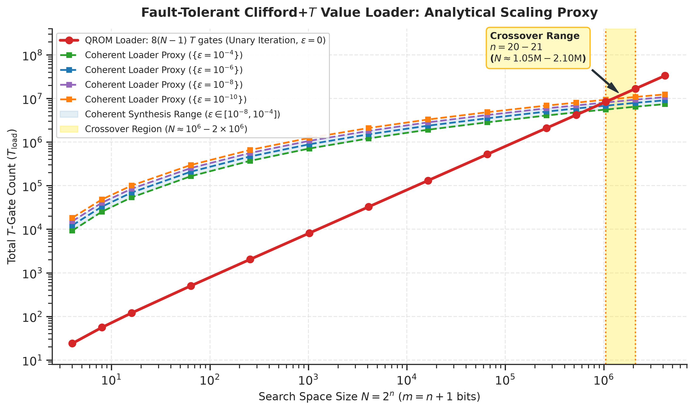

# Dürr–Høyer Quantum Search: Educational Reference Demo

An educational, open-source reference implementation of **quantum minimum finding**: given a function $f(i) = (A \cdot i^2 + B \cdot i + C) \bmod 2^m$ over $N = 2^n$ indices and a query target $t$, find the index whose value is closest to $t$ — i.e., minimizing the distance $|f(i) - t|$ — using Grover search wrapped in the Dürr–Høyer minimum-finding loop with a computed arithmetic oracle.

> [!NOTE]
> **Pedagogical Goal & Framing:**
> This repository demonstrates **how computed arithmetic preserves the asymptotic gate complexity of Grover search** — $O(\text{poly}(\log N) \cdot \sqrt{N})$ — over $\Omega(N)$ lookup tables in quantum search. It explores the practical **metric inversion under fault-tolerant Clifford+T compilation** (where discrete QROM selection trees dominate at small-to-medium $N$ due to rotation synthesis overhead) and contrasts quantum scaling against **classical period-reduction and algebraic baselines**.

---

## Why Computed Oracles Matter (QROM vs. Arithmetic)

In textbook Grover search demonstrations, oracle functions are often treated as lookup tables (QROM). However, a QROM oracle for $N$ values requires $\Omega(N)$ gates per call—**erasing the** $\Theta(\sqrt{N})$ **query advantage of Grover search** at the physical gate level: $O(N\sqrt{N})$ total gates.

To preserve Grover's asymptotic gate advantage in quantum search, the oracle must *compute* $f(i)$ coherently using reversible arithmetic circuits in $O(\text{poly}(\log N))$ gates per call. This repository constructs such an oracle in Qiskit using QFT phase arithmetic (`QuadraticForm`, Draper adder, and `IntegerComparator`).

---

## Quick Start

```bash
git clone https://github.com/jtaroreh/durr-hoyer-quantum-search.git
cd durr-hoyer-quantum-search

# Recommended: reproducible environment with all extras (uv)
uv sync --locked --all-extras

# Standard editable development installation with pip (simulator + plotting)
pip install -e .[all]

# Minimal installation (core algorithm + CLI tables only)
pip install -e .

# Run end-to-end search demo (N=8) and save publication-quality plots
python demo.py --save-plots figures/
# Or use the installed CLI command:
durr-hoyer-demo --save-plots figures/

# Run gate scaling analysis and save complexity + crossover plots
python scaling.py --max-n 12 --save-plots figures/
# Or use the installed CLI command:
durr-hoyer-scale --max-n 12 --save-plots figures/

# View interactive figures directly
python demo.py --plot
python scaling.py --plot

# Generate Markdown scaling and comparison tables directly
python scaling.py --max-n 12 --markdown

# Run test suite with coverage
pytest --cov=closest_search --cov-report=term-missing tests/
```

---

## How It Works

### 1. The Computed Oracle Pipeline (O(poly(log N)) gates, n + 2m + 1 qubits for m > 1)


Figure 1: Architectural schematic of the computed quantum distance oracle pipeline, showing register allocation across 5 quantum registers, coherent arithmetic stages (`QuadraticForm`, Draper constant adder, absolute value), integer comparator, single-qubit phase kick, and exact uncomputation.

1. **Value Function** — `QuadraticForm` computes $|i\rangle|0\rangle \to |i\rangle|f(i)\rangle$ via QFT phase arithmetic in $O(n^2 m)$ gates. Coefficients are explicitly reduced mod $2^m$.
2. **Subtract Target** — Draper QFT constant adder adds $-t$ to the $(m+1)$-bit `(val, sign)` register.
3. **Absolute Value** — Controlled on the sign bit, two's-complement negates lower $m$ bits to yield $|f(i) - t|$.
4. **Comparator & Phase Kick** — `IntegerComparator` (using $m-1$ clean ancillas) sets `flag` iff $|f(i) - t| < \text{threshold}$, and a `Z` gate flips the phase.
5. **Uncomputation** — Exact reverse sequence returns all ancilla/value registers to $|0\rangle$, leaving only phase-marked index states.

### 2. The "Quadratic Sweet Spot" vs. General Function Classes

Why is coherent arithmetic so clean for $f(i) = (a i^2 + b i + c) \pmod{2^m}$?

1. **The Quadratic Sweet Spot (Carry-Free QFT Phase Coupling):**
   Decomposing the index integer $i$ into binary bits $x_j \in \{0, 1\}$ expands the arithmetic directly into pairwise bit products:

   $$i = \sum_{j=0}^{n-1} 2^j x_j \implies a i^2 = \sum_{j,k} a \cdot 2^{j+k} x_j x_k, \qquad b i = \sum_j b \cdot 2^j x_j$$

   Because quadratic terms depend only on pairwise bit products $x_j x_k$, they map directly to 2-qubit controlled-phase rotations in QFT space. This requires **zero carry ancillas** and **zero Toffoli multiplier trees**.
2. **General Function Classes (Cubics, Divisions, Hashes):**
   For higher-degree polynomials like $i^3$, non-polynomial functions (such as reciprocals $1/x$ or square roots), or cryptographic hash primitives (SHA-256, AES S-boxes), QFT phase arithmetic no longer applies without full reversible carry-propagation adder/multiplier networks (e.g. Cuccaro adders, Wallace-tree multipliers), requiring $O(m^2)$ Toffoli gates and substantial dirty/clean ancilla registers.
3. **Why QROM Dominates in Real-World Applications:**
   In quantum chemistry (loading molecular Hamiltonian orbital coefficients; Babbush et al. 2018, Lee et al. 2021) and practical cryptanalysis, values $f(i)$ lack clean algebraic quadratic structure. For practical problem sizes with $N \le 10^5$, optimized QROM with unary iteration and select-swap networks remains the industry standard.

### 3. The Search Loop (Dürr–Høyer + BBHT)

Since the number of marked items is unknown and changes dynamically as the threshold tightens:
1. Sample a random index $i_0$, set $\text{threshold} = |f(i_0) - t|$.
2. Run Grover search using the BBHT exponential schedule with parameter $m_{\text{BBHT}} \to \min((6/5) m_{\text{BBHT}}, \sqrt{N})$.
3. Measure an index $i'$ and verify classically. If $|f(i')-t| < \text{threshold}$, adopt it as the new threshold and reset the schedule.
4. Stop at distance 0 or when the query budget of $\approx 15\sqrt{N}$ is spent.


Figure 2: Left: Search space landscape $|f(i)-t|$ across candidate indices $i$ with the global minimum marked. Right: Dürr–Høyer dynamic threshold ladder stepping down round-by-round until isolating the optimal solution.


Figure 3: Showcase measurement distribution after threshold discovery, comparing amplified probability on the closest set (>94%) against the initial uniform superposition ($1/N = 12.5\%$).

---

## Algorithmic Scaling & Complexity Analysis

### The White-Box vs. Black-Box Paradox & Classical Baselines

A central concept in quantum algorithm analysis is the distinction between white-box and black-box access:

1. **Black-Box Model:** Assumes an opaque $\Theta(N)$ oracle where classical search requires evaluating all $N = 2^n$ indices.
2. **White-Box Model:** When $f(i) = (Ai^2+Bi+C) \bmod 2^m$ is explicitly known (which is necessary to construct a circuit in $O(\text{poly}(\log N))$ gates), classical algorithms are not restricted to exhaustive scanning. They exploit modular periodicity:
   - **Periodicity:** $f(i + 2^m) \equiv f(i) \pmod{2^m}$. For $N > 2^m$, evaluating $2^m$ indices covers all unique function outputs, capping classical evaluations at $\min(N, 2^m)$.
   - **Algebraic Solvers:** Exact modular congruences $f(i) \equiv t \pmod{2^m}$ can be solved even faster in $O(\text{poly}(m))$ using 2-adic / Hensel root-finding.

This project implements both classical baselines (`classical_closest` for black-box and `classical_structured_closest` for period-reduction solving) to demonstrate how white-box structure changes the classical complexity.

`python scaling.py --max-n 12` evaluates gate scaling across distinct regimes:

### Regime 1: Unstructured Index Space (m = n + 1, N ≤ 2ᵐ)

Gate scaling across index qubits $n$ for $f(i) = (2i^2 + 3i + 1) \bmod 2^{n+1}$ with target $t=6$, threshold $1$ (exact unique target $k=1$). Compares transpiled NISQ gates under both Single-Run Grover and Dürr–Høyer minimum finding against classical models:


Figure 4: Log-log scaling of transpiled elementary NISQ gates in basis $\{u, cx\}$ for Single-Run Grover and Dürr–Høyer search (scaling as $\sim \sqrt{N}$) vs. classical black-box bit operations and CPU instructions (scaling as $\sim N$).

> [!IMPORTANT]
> **Unit Mismatch & Operation-Count Framing:**
> Comparing transpiled elementary NISQ gates in basis $\{u, cx\}$ against classical bit/word operations illustrates algorithmic scaling, *not* physical runtime speedup. A single 2-qubit quantum gate cycle is orders of magnitude slower than a 64-bit classical CPU instruction.

<details>
<summary><b>📊 View Full Regime 1 Gate Scaling Data Table (n = 2 to 12, N ≤ 4,096)</b></summary>

| $n$ | $m$ | $N=2^n$ | Q-Oracle (CNOTs) | Q-Iter Gates | Single-Run Q-Gates (Optimal $R$) | Dürr–Høyer Q-Gates (11.25√N + 0.7log²N) | C-BlackBox Bit-Ops | C-BlackBox CPU-Ops |
| --: | --: | ------: | ----------------: | -----------: | --------------------------------: | ---------------------------------------: | -----------------: | ------------------: |
| 2 | 3 | 4 | 515 (246) | 520 | 520 | 13,156 | 52 | 12 |
| 3 | 4 | 8 | 964 (452) | 982 | 1,964 | 37,434 | 200 | 24 |
| 4 | 5 | 16 | 1,547 (734) | 1,580 | 4,740 | 88,796 | 656 | 48 |
| 5 | 6 | 32 | 2,284 (1,096) | 2,367 | 9,468 | 192,057 | 1,952 | 96 |
| 6 | 7 | 64 | 3,235 (1,578) | 3,420 | 20,520 | 393,984 | 5,440 | 192 |
| 7 | 8 | 128 | 4,374 (2,160) | 4,660 | 37,280 | 752,959 | 14,464 | 384 |
| 8 | 9 | 256 | 5,777 (2,898) | 6,184 | 74,208 | 1,390,163 | 37,120 | 768 |
| 9 | 10 | 512 | 7,402 (3,756) | 7,956 | 135,252 | 2,476,372 | 92,672 | 1,536 |
| 10 | 11 | 1,024 | 9,341 (4,806) | 10,069 | 251,725 | 4,329,670 | 226,304 | 3,072 |
| 11 | 12 | 2,048 | 11,536 (5,996) | 12,533 | 438,655 | 7,442,307 | 542,720 | 6,144 |
| 12 | 13 | 4,096 | 14,095 (7,414) | 15,330 | 766,500 | 12,582,864 | 1,282,048 | 12,288 |

*Notes on accounting:*
- **Single-Run Grover:** Ideal single-run using exact discrete candidate evaluation $R = \arg\max_R \sin^2((2R+1)\arcsin\sqrt{k/N})$ over integers neighboring $R^* = (\pi - \theta)/(2\theta)$ with $\theta = 2\arcsin\sqrt{k/N}$, correctly yielding $R=1$ at $N=4, k=1$ and $R=0$ when $k > N/2$ without destructive over-rotation.
- **Dürr–Høyer (1996) Gate Envelope:** Proven expected total query complexity $(45/4)\sqrt{N} + 0.7\log_2^2 N$ function evaluation calls across randomized rounds (Grover search queries + classical candidate verifications). Gate total models an all-quantum query execution upper bound: $E[Q_{\text{quant}}] \times G_{\text{iter}}$.
- **Classical CPU-Ops:** Modern word-RAM CPU evaluates $(A \cdot i^2 + B \cdot i + C) \bmod 2^m$ in $\approx 3$ CPU instructions.
- **Classical Bit-Ops:** Software bit-level gate model: $n^2 + nm + m$ bit operations.

</details>

### Regime 2: Periodic Index Space (Fixed m = 4, n > m)

When $N > 2^m$, modular periodicity $f(i + 2^m) \equiv f(i) \pmod{2^m}$ caps classical evaluations at $2^m = 16$.

<details>
<summary><b>📊 View Periodic Index Space Scaling Data Table (Fixed m = 4, n = 4 to 8)</b></summary>

| $n$ | $m$ | $N=2^n$ | $2^m$ | C-BlackBox Evals | C-Struct Evals | C-BlackBox Ops | C-Struct Ops |
| --: | --: | ------: | ----: | ---------------: | -------------: | -------------: | -----------: |
| 4 | 4 | 16 | 16 | 16 | 16 | 576 | 576 |
| 5 | 4 | 32 | 16 | 32 | 16 | 1,568 | 784 |
| 6 | 4 | 64 | 16 | 64 | 16 | 4,096 | 1,024 |
| 7 | 4 | 128 | 16 | 128 | 16 | 10,368 | 1,296 |
| 8 | 4 | 256 | 16 | 256 | 16 | 25,600 | 1,600 |

</details>

### Empirical QROM vs. Computed Oracle Comparison (n ≤ 6)

Direct gate-level comparison between an explicit value-loading QROM oracle ($|i\rangle|0\rangle \to |i\rangle|f(i)\rangle$, optimized with Gray-code multi-controlled $X$ traversal) and the coherent arithmetic oracle (`QuadraticForm`), both transpiled to elementary basis $\{u, cx\}$ under `optimization_level=1, seed_transpiler=42` using the identical subtraction, absolute value, and comparator pipeline:


Figure 5: Left: Transpiled gate counts in basis $\{u, cx\}$ for Gray-code tabular QROM vs. coherent QuadraticForm arithmetic. Right: QROM gate overhead multiplier ($11.38\times$ at $N=64$).

Gray-code traversal with $g_k = k \oplus (k \gg 1)$ eliminates multi-qubit $X$ decoding sweeps, flipping only 1 index qubit per transition. While coherent QFT phase arithmetic scales as $O(n^2 m)$, tabular QROM scales as $\Theta(m \cdot 2^n)$, requiring **1.56× more gates** at $n=3$ ($N=8$), **3.09× more gates** at $n=4$ ($N=16$), and **11.38× more gates** at $n=6$ ($N=64$).

<details>
<summary><b>📊 View Empirical QROM vs Computed Gate Count Data Table (n = 2 to 6)</b></summary>

| $n$ | $m$ | $N=2^n$ | QROM Oracle Gates | Computed Oracle Gates | Ratio (QROM / Computed) |
| --: | --: | ------: | -----------------: | --------------------: | -----------------------: |
| 2 | 3 | 4 | 516 | 515 | 1.00x |
| 3 | 4 | 8 | 1,501 | 964 | 1.56x |
| 4 | 5 | 16 | 4,777 | 1,547 | 3.09x |
| 5 | 6 | 32 | 13,404 | 2,284 | 5.87x |
| 6 | 7 | 64 | 36,819 | 3,235 | 11.38x |

</details>

---

## Fault-Tolerant (FTQC) Clifford+T Resource Scaling Proxy & Crossover

In fault-tolerant quantum computing (FTQC), arbitrary single-qubit rotations (such as QFT phase angles) are not native gates. They must be synthesized into sequences of Clifford+T gates via magic state distillation factories (Ross & Selinger 2016, *Phys. Rev. A* 94, 012327). In contrast, discrete logical operations (like multi-controlled X / Toffoli gates in QROM lookup trees) decompose directly into discrete Clifford+T primitives without continuous rotation synthesis error ($\varepsilon = 0$).

### 1. Architectural Pipeline Separation

The complete search oracle decomposes into two independent stages:

| Stage | Sub-Circuits | FTQC Compilation Primitives |
| :--- | :--- | :--- |
| **Value Loader** (Coherent) | `QuadraticForm` | QFT phase coupling: $K_{\text{total}} = 12nm + 7n(n-1)m + 6m(m-1)$ rotations synthesized to error $\varepsilon / K_{\text{total}}$ (unassisted, or $4 R_z$ per $CCPhase$ with 1 clean ancilla). |
| **Value Loader** (QROM) | Unary Iteration Table (Babbush 2018) | Discrete binary selection tree: $N-1$ Toffolis ($4T$ each via measurement-assisted synthesis). Reversible uncomputation yields exactly $8(N-1)$ $T$ gates with $\varepsilon = 0$, independent of $m$. |
| **Common Downstream Pipeline** | `add_constant(-t)`, `absolute_value`, `IntegerComparator`, `Z(flag)` | Draper adder + two's complement absolute value with $K_{\text{downstream}} = 12m^2+8m+2$ $R_z$ rotations plus ripple-carry comparator with $16(m-1)$ $T$ gates. Shared identically by both loader architectures. |

<details>
<summary><b>📐 View Mathematical Rotation Decomposition & Clifford+T Synthesis Model</b></summary>

1. **Rotation Synthesis Proxy (Ross & Selinger 2016):** An arbitrary single-qubit Z-rotation $R_z(\theta)$ synthesized to precision $\varepsilon_{\text{rot}} = \varepsilon / K$ requires approximately:

   $$T(R_z, \varepsilon_{\text{rot}}) \approx \left\lceil 3 \log_2\left(\frac{K}{\varepsilon}\right) \right\rceil$$

2. **Coherent Arithmetic Loader (`QuadraticForm`):** Decomposes into:
   - Linear terms: $nm$ controlled-phase $CP$ gates costing $3 R_z$ each, totaling $3nm R_z$ rotations.
   - Diagonal quadratic terms where $j = k$: $nm$ controlled-phase $CP$ gates costing $3 R_z$ each, totaling $3nm R_z$ rotations. *(Note: In binary arithmetic $x_j^2 = x_j$, so compilers merge linear and diagonal terms into $nm$ gates; this unmerged closed form provides a clean, conservative analytical proxy).*
   - Off-diagonal quadratic terms where $j < k$: $\frac{1}{2}n(n-1)m$ doubly-controlled phase $CCPhase$ gates, requiring $7 R_z$ each unassisted ($\frac{7}{2}n(n-1)m R_z$ rotations) or $4 R_z$ with 1 clean ancilla ($2n(n-1)m R_z$ rotations).
   - Result register QFT/IQFT: $m(m-1)$ controlled-phase $CP$ gates costing $3 R_z$ each, yielding $3m(m-1) R_z$ rotations.

   Accounting for forward compute and uncompute ($2\times$ factor), total non-Clifford rotations:

   $$K_{\text{total}} = 12nm + 7n(n-1)m + 6m(m-1) \quad (\text{unassisted}), \quad 12nm + 4n(n-1)m + 6m(m-1) \quad (\text{ancilla-assisted})$$

   $$T_{\text{coherent}}(n, m, \varepsilon) = K_{\text{total}} \cdot \left\lceil 3 \log_2\left(\frac{K_{\text{total}}}{\varepsilon}\right) \right\rceil$$

3. **QROM Unary Iteration Loader (Babbush et al. 2018):**

   $$T_{\text{QROM}}(n) = 8(2^n - 1)$$

</details>

### 2. Dual Fault-Tolerant Resource Comparison (Crossover at N ≈ 10⁶)


Figure 6: Log-log comparison of analytical Clifford+T gate cost proxies for discrete QROM with $8(N-1)$ $T$-gates vs. coherent arithmetic across synthesis precision budgets $\varepsilon$, illustrating the crossover band at $N \approx 10^6 \text{ to } 2 \times 10^6$.

<details>
<summary><b>📊 View Regime 3A: Fault-Tolerant Value Loader Comparison Table (T_load, n = 2 to 20)</b></summary>

Evaluating `python scaling.py --max-n 12 --markdown` isolates the **Value Loader stage** ($T_{\text{load}}$) between the discrete selection tree QROM loader ($8(N-1)$ $T$-gates, $\varepsilon=0$, Babbush et al. 2018 unary iteration) and the coherent arithmetic loader (`QuadraticForm`, modeled via Ross & Selinger 2016 gridsynth proxy with $CP \to 3 R_z$ and $CCPhase \to 7 R_z$ rotations) across synthesis error budgets $\varepsilon \in \{10^{-4}, 10^{-6}, 10^{-8}, 10^{-10}\}$:

| $n$ | $m$ | $N=2^n$ | QROM Loader $T$ ($8(N-1)$) | Coherent Loader $T$ ($\varepsilon=10^{-4}$) | Coherent Loader $T$ ($\varepsilon=10^{-6}$) | Coherent Loader $T$ ($\varepsilon=10^{-8}$) | Coherent Loader $T$ ($\varepsilon=10^{-10}$) | Loader Ratio ($\varepsilon=10^{-6}$) |
| --: | --: | ------: | -------------------------: | -------------------------------------------: | -------------------------------------------: | -------------------------------------------: | --------------------------------------------: | -------------------------------------: |
| 2 | 3 | 4 | 24 | 9,300 | 12,300 | 15,300 | 18,300 | QROM 512.5x cheaper |
| 3 | 4 | 8 | 56 | 25,344 | 33,024 | 40,704 | 48,384 | QROM 589.7x cheaper |
| 4 | 5 | 16 | 120 | 53,820 | 69,420 | 85,020 | 100,620 | QROM 578.5x cheaper |
| 6 | 7 | 64 | 504 | 164,724 | 209,244 | 253,764 | 298,284 | QROM 415.2x cheaper |
| 8 | 9 | 256 | 2,040 | 371,448 | 467,928 | 564,408 | 660,888 | QROM 229.4x cheaper |
| 10 | 11 | 1,024 | 8,184 | 712,800 | 891,000 | 1,069,200 | 1,247,400 | QROM 108.9x cheaper |
| 12 | 13 | 4,096 | 32,760 | 1,215,240 | 1,511,640 | 1,808,040 | 2,104,440 | QROM 46.1x cheaper |
| 14 | 15 | 16,384 | 131,064 | 1,922,760 | 2,380,560 | 2,838,360 | 3,296,160 | QROM 18.2x cheaper |
| 16 | 17 | 65,536 | 524,280 | 2,843,760 | 3,512,880 | 4,182,000 | 4,851,120 | QROM 6.7x cheaper |
| 18 | 19 | 262,144 | 2,097,144 | 4,076,298 | 5,013,378 | 5,950,458 | 6,887,538 | QROM 2.4x cheaper |
| 19 | 20 | 524,288 | 4,194,296 | 4,815,360 | 5,909,760 | 6,949,440 | 8,043,840 | QROM 1.4x cheaper |
| 20 | 21 | 1,048,576 | 8,388,600 | 5,580,960 | 6,849,360 | 8,117,760 | 9,386,160 | Coh 1.22x cheaper |

</details>

<details>
<summary><b>📊 View Regime 3B: Fault-Tolerant Full Distance Oracle Comparison Table (T_oracle, n = 2 to 20)</b></summary>

Fault-tolerant Clifford+T cost comparison for the **complete Distance Oracle** (Value Loader + Draper Subtraction + Absolute Value + Comparator + Phase Kick + Uncomputation), allocating error budget $\varepsilon_{\text{stage}} = \varepsilon / 2$ equally between value loading and downstream arithmetic:

| $n$ | $m$ | $N=2^n$ | QROM Full Oracle $T$ ($\varepsilon=10^{-6}$) | Coh Full Oracle $T$ ($\varepsilon=10^{-4}$) | Coh Full Oracle $T$ ($\varepsilon=10^{-6}$) | Coh Full Oracle $T$ ($\varepsilon=10^{-8}$) | Coh Full Oracle $T$ ($\varepsilon=10^{-10}$) | Oracle Ratio ($\varepsilon=10^{-6}$) |
| --: | --: | ------: | -------------------------------------------: | ------------------------------------------: | ------------------------------------------: | ------------------------------------------: | -------------------------------------------: | -------------------------------------: |
| 2 | 3 | 4 | 11,312 | 18,492 | 24,038 | 29,718 | 35,398 | QROM 2.1x cheaper |
| 3 | 4 | 8 | 19,766 | 41,686 | 53,886 | 66,086 | 78,286 | QROM 2.7x cheaper |
| 4 | 5 | 16 | 30,622 | 79,822 | 102,262 | 124,360 | 146,800 | QROM 3.3x cheaper |
| 6 | 7 | 64 | 59,386 | 217,364 | 274,804 | 332,244 | 389,684 | QROM 4.6x cheaper |
| 8 | 9 | 256 | 99,446 | 462,406 | 579,806 | 697,206 | 814,606 | QROM 5.8x cheaper |
| 10 | 11 | 1,024 | 154,834 | 855,340 | 1,064,380 | 1,273,420 | 1,482,460 | QROM 6.9x cheaper |
| 12 | 13 | 4,096 | 237,816 | 1,424,210 | 1,761,156 | 2,100,236 | 2,439,316 | QROM 7.4x cheaper |
| 14 | 15 | 16,384 | 407,844 | 2,211,770 | 2,726,010 | 3,240,250 | 3,754,490 | QROM 6.7x cheaper |
| 16 | 17 | 65,536 | 881,530 | 3,229,258 | 3,970,498 | 4,711,738 | 5,452,978 | QROM 4.5x cheaper |
| 18 | 19 | 262,144 | 2,546,032 | 4,576,028 | 5,602,828 | 6,629,628 | 7,656,428 | QROM 2.2x cheaper |
| 19 | 20 | 524,288 | 4,690,800 | 5,376,784 | 6,570,424 | 7,709,344 | 8,902,984 | QROM 1.4x cheaper |
| 20 | 21 | 1,048,576 | 8,940,582 | 6,213,962 | 7,591,602 | 8,963,780 | 10,341,420 | Coh 1.18x cheaper |

</details>

### 3. Key Fault-Tolerant Insights & Methodology Context

1. **Why QROM is Dramatically Cheaper at Small-to-Medium Problem Sizes (N ≤ 10⁵):**
   Under raw NISQ uncompiled gates in basis $\{u, cx\}$, coherent arithmetic appears immediately cheaper than QROM because a continuous phase gate $CP(\theta)$ is counted as a single unit gate. However, in FTQC, each continuous rotation costs $\approx 60\text{--}150$ $T$ gates to synthesize via magic state distillation. In contrast, discrete Toffolis require exactly $4T$ gates with zero synthesis overhead at $\varepsilon = 0$. Consequently, QROM is dramatically cheaper until $N \approx 10^6$.
2. **Analytical Gridsynth Proxy Assumption:**
   The coherent arithmetic model treats all $K_{\text{total}}$ rotations as arbitrary continuous $R_z$ angles synthesized via gridsynth. In practice, low-order dyadic QFT/quadratic angles ($CZ$, $\text{Controlled-}S$, $T$) compile into exact Clifford+T gates without $\varepsilon$-synthesis, and binary diagonal merging ($x_j^2 = x_j$) reduces phase couplings. Treating all rotations as unmerged arbitrary gridsynth calls provides an analytical proxy upper bound on coherent arithmetic $T$-count; compiling exact dyadics or utilizing ancilla assistance ($4 R_z$ per $CCPhase$) reduces coherent $T$-count and shifts the crossover point leftward.
3. **Toffoli Synthesis Model:**
   QROM Toffoli accounting ($4T$ compute, $8T$ reversible uncompute) models measurement-assisted / catalyst state distillation (Jones 2013, Gidney 2018); standard unitary Clifford+T Toffolis cost $7T$ each.
4. **The FTQC Crossover Range (N ≈ 10⁶ to 2 × 10⁶):**
   The asymptotic scaling of coherent arithmetic, $O(n^3 \log(1/\varepsilon))$, eventually beats exponential QROM, $O(2^n)$, crossing over at $n = 20\text{--}21$, corresponding to $N \approx 1,048,576 \text{ to } 2,097,152$ candidate states.

---

## Codebase Architecture

| File | Description |
| :--- | :--- |
| `closest_search/circuits.py` | Quantum circuit builders (`value_function`, `add_constant`, `absolute_value`, `distance_oracle`, `qrom_value_function`, `qrom_distance_oracle`, `diffuser`, `total_oracle_qubits`) |
| `closest_search/ftqc.py` | Fault-tolerant Clifford+T cost proxies (`FTQCResourceVector`, discrete QROM vs. continuous rotation synthesis) and classical operation metrics |
| `closest_search/nisq.py` | Centralized NISQ complexity computation records, exact Grover iteration formula, and scaling models for CLI tables and figures |
| `closest_search/search.py` | Dürr–Høyer search driver, BBHT schedule, `closest_value_search` (with total qubit guard and circuit caching), `classical_closest`, `classical_structured_closest`, and `classical_algebraic_closest` |
| `closest_search/plotting.py` | Seaborn & Matplotlib visualization suite for search trajectories, probability distributions, gate scaling, and FTQC crossovers (with sensitivity bands and precomputed record support) |
| `demo.py` | Command-line demo displaying round evolution, dual classical baselines, showcase histogram, and figure generation (`--plot`, `--save-plots`) |
| `scaling.py` | Gate scaling analysis across dual NISQ regimes, empirical QROM comparison, FTQC Clifford+T estimation, and scaling plots (`--plot`, `--save-plots`) |
| `tests/test_closest_search.py` | Unit tests for circuit statevectors, QROM value loader/oracle, FTQC Clifford+T models, structured baseline, algebraic solver, and budget bounds |
| `tests/test_readme_tables.py` | Automated reproducibility verification ensuring README markdown tables match locked environment computations |
| `tests/test_plotting.py` | Unit tests for all Seaborn and Matplotlib visualization and figure generation routines |
| `pyproject.toml` | PEP 621 Python package metadata, SPDX license, type marker configuration, and optional extras (`sim`, `plot`, `dev`, `all`) |
| `CITATION.cff` | Open-source academic citation metadata |
| `.github/workflows/ci.yml` | Automated GitHub Actions CI test matrix with least-privilege permissions, concurrency control, and job isolation |

